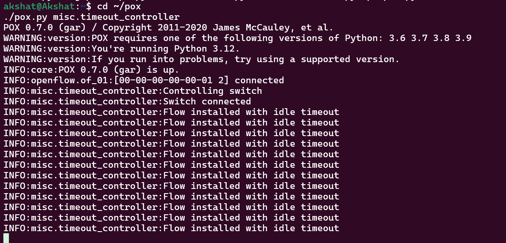
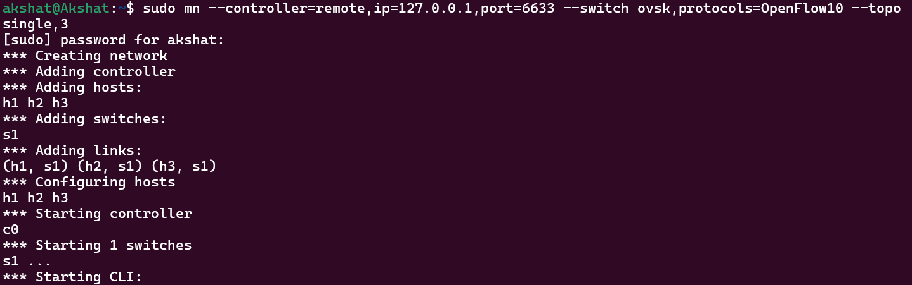
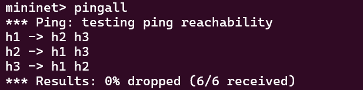
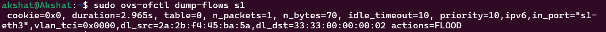
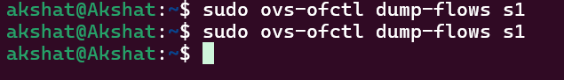
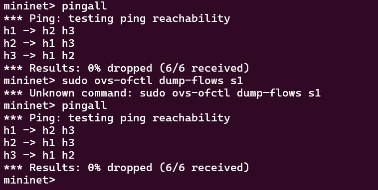
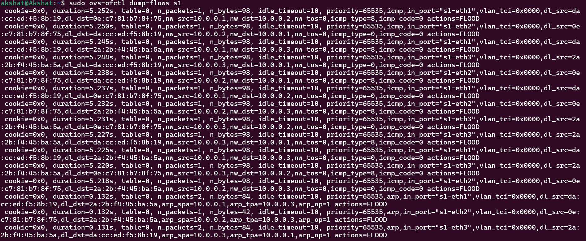

# Flow Rule Timeout Manager using POX + Mininet

### NAME : 
Akshat Kumar
### SRN :
PES2UG24CS046
### SECTION :
4 A

## Problem Statement

Implement timeout-based flow rule management in an SDN environment using Mininet and POX controller.

### Required Objectives

* Configure idle timeouts
* Remove expired flow rules automatically
* Demonstrate rule lifecycle
* Analyze timeout behavior
* Perform regression testing to ensure consistency

---

## Technologies Used

* Ubuntu (WSL / Linux)
* Mininet
* Open vSwitch
* POX Controller
* OpenFlow 1.0

---

## Project Objective

The objective of this project is to implement dynamic flow rule management using idle timeout in Software Defined Networking (SDN).

When packets arrive at the switch without matching flow entries, the switch sends a PacketIn event to the controller. The controller installs a flow rule with an idle timeout of 10 seconds.

If the flow remains inactive for 10 seconds, the switch automatically removes the rule.

This demonstrates efficient flow table management and dynamic rule handling.

---

## Controller Logic

### File Name

`timeout_controller.py`

### Controller Used

POX Controller

### Flow Rule Configuration

* Match: Packet-based match using `ofp_match.from_packet()`
* Action: Flood packet using `OFPP_FLOOD`
* Priority: 10
* Idle Timeout: 10 seconds
* Hard Timeout: 0 (disabled)

### Timeout Behavior

If no packets match the installed rule for 10 seconds:

* the rule expires automatically
* the switch removes the rule

When traffic appears again:

* PacketIn event occurs again
* controller reinstalls the rule

---

## Project Folder Structure

```text
~/pox/
 ├── pox.py
 ├── pox/
      ├── misc/
           ├── timeout_controller.py
```

---

## How to Run the Project

## Step 1: Start POX Controller

```bash
cd ~/pox
./pox.py misc.timeout_controller
```

---

## Step 2: Clean Previous Mininet Configuration

```bash
sudo mn -c
```

---

## Step 3: Start Mininet Topology

```bash
sudo mn --controller=remote,ip=127.0.0.1,port=6633 \
--switch ovsk,protocols=OpenFlow10 \
--topo single,3
```

This creates:

* 1 switch
* 3 hosts

---

## Step 4: Test Connectivity

Inside Mininet:

```bash
pingall
```

Expected:

```text
0% packet loss
```

---

## Step 5: Verify Installed Flow Rules

```bash
sudo ovs-ofctl dump-flows s1
```

Expected:

```text
idle_timeout=10
priority=10
```

---

## Step 6: Wait for Timeout Expiration

Wait for 10–15 seconds without sending traffic.

Then run again:

```bash
sudo ovs-ofctl dump-flows s1
```

Expected:

Previously installed rule disappears automatically.

---

## Step 7: Re-trigger Traffic

```bash
pingall
```

Flow rule gets installed again.

This confirms complete lifecycle.

---

## Flow Rule Lifecycle

```text
Packet arrives
↓
No matching rule
↓
PacketIn sent to controller
↓
Controller installs flow rule
↓
Traffic forwarded normally
↓
10 sec inactivity
↓
Rule expires automatically
↓
New traffic arrives
↓
Rule installed again
```

---

## Performance Observation

### Latency

Measured using:

```bash
pingall
```

Observation:

* first packet slightly delayed due to PacketIn
* subsequent packets faster due to installed flow rule

---

### Flow Table Observation

Measured using:

```bash
sudo ovs-ofctl dump-flows s1
```

Observation:

* flow entries appear after traffic
* entries disappear after timeout

This confirms timeout-based management.

---

## Regression Testing

Repeated the following multiple times:

```bash
pingall
wait 10 sec
dump-flows
pingall
dump-flows
```

Observed same timeout behavior consistently.

This confirms stable implementation.

---

## Proof of Execution (Screenshots)

### Screenshot 1


POX Controller Running

### Screenshot 2


Mininet Topology Created

### Screenshot 3


Successful pingall Result

### Screenshot 4


Flow Table Showing idle_timeout=10

### Screenshot 5


Flow Rule Removed After Timeout

### Screenshot 6



Flow Rule Reinstalled After New Traffic

---

## Conclusion

This project successfully demonstrates timeout-based flow rule management using SDN.

The switch dynamically installs flow rules when traffic arrives and removes inactive rules automatically using idle timeout.

This improves scalability, avoids stale entries, and demonstrates efficient SDN controller-switch interaction.

---

## References

1. Mininet Official Documentation
   https://mininet.org/

2. Mininet Walkthrough
   https://mininet.org/walkthrough/

3. POX Controller Documentation
   https://github.com/noxrepo/pox

4. OpenFlow Switch Specification

5. Course Guidelines Provided by Faculty
